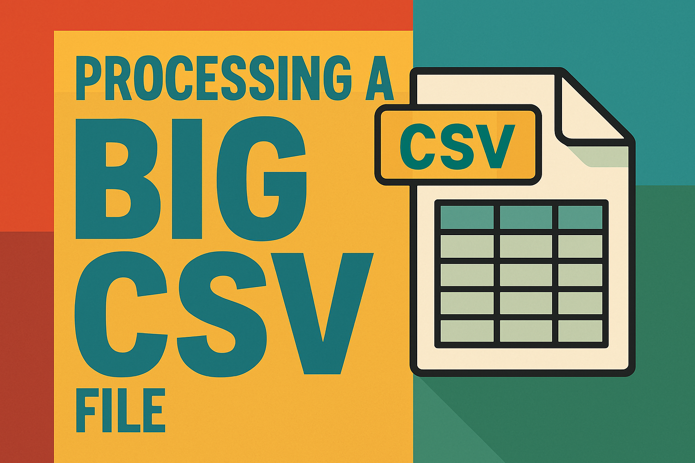

  

---

### **🚀 Introducing: The Swiss Army Knife of CSV Files – Now with Extra Chaos!**  

Ever looked at a massive CSV file and thought, *"This is fine"*—while your computer wheezes like it's running a marathon? Fear not, my data-wrangling friend! **CsvDataUtil** is here to turn your CSV nightmares into a walk in the park (or at least a slightly less chaotic jog).  

#### **✨ What Does It Do?**  
Imagine if a **file splitter**, a **merger**, a **filtering wizard**, and a **shuffling DJ** had a baby. That's **CsvDataUtil**! Here's the magic it brings to the table:  

1. **Split Files Like a Pro**  
   - Got a 10GB CSV file? No problem! Slice it into bite-sized chunks faster than a ninja chopping veggies.  

2. **Merge Files Like a Boss**  
   - Combine files with the grace of a ballet dancer—or, if you prefer, the brute force of a bulldozer. Your call.  

3. **Filter Like a Bouncer at an Exclusive Club**  
   - "You're not on the list? Sorry, buddy." Kick out unwanted rows with surgical precision.  

4. **Shuffle Data Like a Deck of Cards**  
   - Need randomness? We'll shuffle your data so well, even *it* won't know where it belongs anymore.  

5. **Extract Data Like a Treasure Hunter**  
   - Want 10% of your data for testing? We'll grab it faster than a seagull snatching fries.  

6. **Handle Massive Files Without Melting Your RAM**  
   - 5 billion phone numbers? Pfft. We'll shuffle them on disk like a lazy but efficient librarian.  

#### **🤔 Why Should You Care?**  
- **Your Computer Will Thank You**: No more crashing when you sneeze at a large file.  
- **Your Boss Will Love You**: "How did you process that so fast?" *"Magic."* (Or just **CsvDataUtil**.)  
- **Your Sanity Will Stay Intact**: Because manually editing CSV files is the 8th circle of hell.  

#### **🎤 Testimonials (From My Imagination)**  
- *"I used to cry myself to sleep over CSV files. Now I cry tears of joy!"* – A Very Relieved Developer  
- *"This tool is so good, I'm suspicious it's powered by dark magic."* – A Skeptical but Happy User  

#### **🚀 Ready to Dive In?**  
Check out the [README](README.md) for the full feature list, or just **clone it and start playing**. Your CSV files will never be the same again.  

**Pro Tip**: If your data starts behaving, you're probably using it wrong.  

--- 

